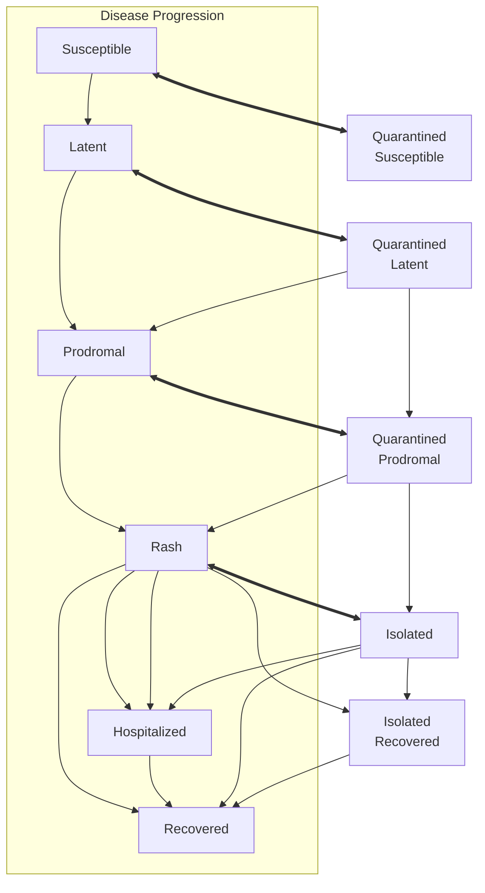
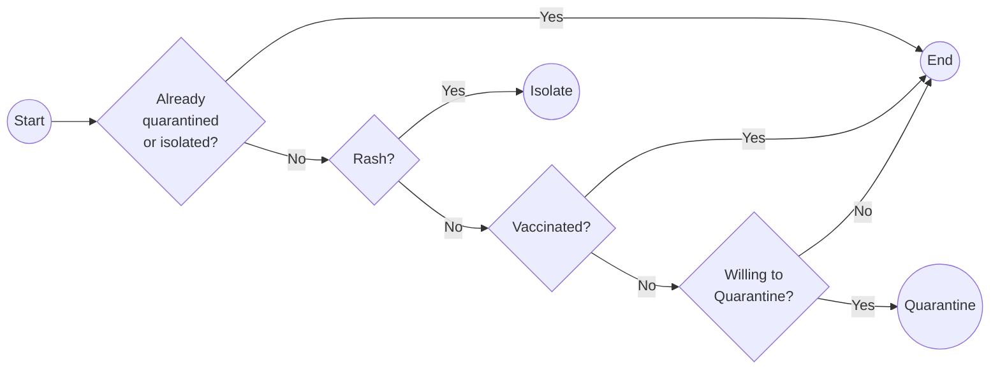

# idcup

[](https://github.com/EpiForeSITE/idcup/actions/workflows/render_reports.yml) [](https://github.com/EpiForeSITE/idcup/actions/workflows/update_measles_cases.yml)

Agent-based measles outbreak simulations across major U.S. cities, built on [epiworldR](https://github.com/UofUEpiBio/epiworldR) and the [measles](https://github.com/UofUEpiBio/measles) R package. Scenarios are parameterized Quarto documents that can be rendered per city using census-derived age structure and MMR vaccination coverage. You can see the latest version of the simulations in the [README](./README.md).

For a high-level overview of the project, see [README.md](./README.md).

## Cities covered

Los Angeles, San Francisco, New York City, Boston, Houston, Dallas, Philadelphia, Atlanta, Seattle, Miami, Kansas City.

## Repository layout

```
data/
  census_age.csv       Age-structured population counts by city (generated)
  census_age.R         Script to pull county-level census data via multigroup.vaccine
  measles_cases.csv    County-level measles case updates mapped to project cities (generated)
  measles_cases.R      Script to pull measles case updates for project cities
  population.csv       Total city populations (source: census.gov)
  mmr.csv              MMR vaccination estimates by city (source: CDC MMWR 2023-24)
scenarios/
  template.qmd         Parameterized Quarto scenario document
  data/                City-specific data symlinked/copied for rendering
sensitivity_analyses/
  scaling_analysis.md  Report on why downscaling works in the model   
  seeds_vs_outbreak_controls.qmd  Seed-vs-outbreak analysis with demographic controls
Makefile               Targets for data generation and package updates
```

## Getting started

### Prerequisites

Install the required R packages from GitHub:

```r
# The measles and epiworldR packages
install.packages(
  c('epiworldR', 'measles'),
  repos = c(
    'https://uofuepibio.r-universe.dev',
    'https://cloud.r-project.org'
))

# The multigroup.vaccine
install.packages(
  c('multigroup.vaccine'),
  repos = c(
    'https://epiforesite.r-universe.dev',
    'https://cloud.r-project.org'
))
```

Or use the Makefile targets:

```bash
make update-measles
```

### Regenerate census age data

```bash
make data/census_age.csv
```

This calls `data/census_age.R`, which queries 2024 county-level census data for each city and writes `data/census_age.csv`.

### Run a scenario

Render the template for a specific city:

```bash
quarto render scenarios/template.qmd -P city:"Miami"
```

## Data sources

| File | Source |
|------|--------|
| `population.csv` | U.S. Census Bureau |
| `census_age.csv` | U.S. Census Bureau (2024, county-level, via `multigroup.vaccine`) |
| `measles_cases.csv` | [CSSEGISandData/measles_data](https://github.com/CSSEGISandData/measles_data) county-level update feed |
| `mmr.csv` | [CDC MMWR 2023–24 kindergarten vaccination coverage](https://www.cdc.gov/mmwr/volumes/73/wr/mm7341a3.htm) |
| `world_cup_matches.csv` | List of World Cup matches ([Wikipedia](https://en.wikipedia.org/w/index.php?title=2026_FIFA_World_Cup&oldid=1351016947#Match_schedule)); generated via `data/world_cup_matches.R` |
| `mixing_matrix.rds` | US-based mixing data from [EpiStorm-Mix](https://www.epistorm.org/data/epistorm-mix) |

Relevant age groups are 0to4, 5to9, 10to14, 15to19, 20to24, 25to29, 30to34, 35to39, 40to44, 45to49, 50to54, 55to59, 60to64, 65to69, 70to74, 75to79, 80plus.

## Model overview

Each scenario runs an age-structured Agent-Based Model (ABM) of Measles with mixing populations. The model's main components are:

- Agents are organized based on age groups with their size informed by the US Census.
- Contact rates are based on the Epistorm-Mix data and scaled using US Census.
- Agents with Rash can be detected and trigger a quarantine process based on contact tracing.

Because the model uses a contact matrix, agents have heterogeneous contact rates across groups.

### Transition dynamics



### Quarantine Process



### Implementation

We are using the [`{measles}`](https://github.com/UofUEpiBio/measles) R package, which runs on the C++ [`epiworld`](https://github.com/UofUEpiBio/epiworld) library.

## Parameters & references

The table lists every parameter of `ModelMeaslesMixing()` used by the city scenarios, including the ones left at the package defaults. It also lists the inputs that set the target R0 and the contact matrix. Values come from [`scenarios/template.qmd`](scenarios/template.qmd). All 11 cities use the same template, so only the city-specific inputs (population, age structure, coverage and initial cases) vary between scenarios.

The canonical, cited table of measles parameters lives in the `measles` R package: [`inst/extdata/measles_parameters.csv`](https://github.com/UofUEpiBio/measles/blob/main/inst/extdata/measles_parameters.csv). The [Parameters and literature references](https://github.com/UofUEpiBio/measles/blob/main/vignettes/parameters.qmd) vignette explains it, and `measles::measles_parameters()` reads it. This project follows [EpiForeSITE/measles#5](https://github.com/EpiForeSITE/measles/issues/5): no values change, and the table records what this project uses and why.

| Parameter | Value used | Package default | Source | Notes / why different |
|---|---|---|---|---|
| R0 (calibration target) | 12 | 15 | Guerra et al. 2017, *Lancet Infect Dis*, [doi:10.1016/S1473-3099(17)30307-9](https://doi.org/10.1016/S1473-3099(17)30307-9) | **Differs.** Lower end of the 12–18 range in Guerra et al. Not a model argument: it is the `target_rep_number` of `calibrate_mixing_model()`, which scales the contact matrix. |
| Transmission rate (`transmission_rate`) | 0.2 | 0.9 | Assumption; the contact matrix is calibrated to R0 | **Differs.** With a contact matrix, R0 depends on the product of transmission and contacts. Transmission is fixed at 0.2 and the Epistorm-Mix matrix is rescaled so that R0 = 12. The same 0.2 is passed to `calibrate_mixing_model(transmission_prob = 0.2)`. |
| Infectious period used in calibration | 4 days | — (no default) | Equals the prodromal period default (4 days) | Argument `infectious_period_days = 4` of `calibrate_mixing_model()`. It matches the prodromal period, the only infectious stage with contacts: with `rash_reduction_contact_rate = 1`, agents with rash stay home. |
| Contact matrix (`contact_matrix`) | Epistorm-Mix US total contacts, 5-year age groups to 80+ (`Total-M-by5_80-matrix.csv`), made reciprocal and scaled to R0 = 12 | — (no default) | Litvinova et al. 2025, *medRxiv*, [doi:10.1101/2025.11.20.25340662](https://doi.org/10.1101/2025.11.20.25340662). Data: [epistorm/Epistorm-Mix](https://github.com/epistorm/Epistorm-Mix) at commit [`05966ba`](https://github.com/epistorm/Epistorm-Mix/blob/05966ba49c7b49fb1cd902d6b98b3be0bb2785a8/matrices/M_matrix/Total-M-by5_80-matrix.csv); see also the [Epistorm-Mix page](https://www.epistorm.org/data/epistorm-mix) | Downloaded by [`data/mixing_matrix.R`](data/mixing_matrix.R) into `data/mixing_matrix.rds`. Each scenario makes it reciprocal with `make_cmat_symmetric()` using the city's census age structure, so that N(i)·C(i,j) = N(j)·C(j,i). It is then multiplied by the scale factor from `calibrate_mixing_model()`. |
| Calibration method | Next-generation matrix | Calibrated to the target R0 | Diekmann et al. 2010, *J R Soc Interface* 7(47):873–885, [doi:10.1098/rsif.2009.0386](https://doi.org/10.1098/rsif.2009.0386) | Via `measles::calibrate_mixing_model()`, the same method as the canonical table. |
| Population size (`n`) | min(`max_pop`, city population): 50,000 in the rendered reports (`MAX_POP` in the `Makefile` and the `render_reports` workflow); the template default is 10,000 | — (no default) | [`data/population.csv`](data/population.csv) (U.S. Census Bureau) | Cities are scaled down to `max_pop` agents. [`sensitivity_analyses/scaling_analysis.md`](sensitivity_analyses/scaling_analysis.md) explains why downscaling works. |
| Age structure (entities) | City age counts in 17 groups (0to4 … 80plus), rescaled to `n` | — | [`data/census_age.csv`](data/census_age.csv): 2024 county-level U.S. Census, via `multigroup.vaccine` | Scenario input. |
| Vaccination coverage (`prop_vaccinated`) | City MMR coverage from [`data/mmr.csv`](data/mmr.csv), 88.1% (Miami) to 96.7% (New York City), applied to every age group | — (no default) | [CDC MMWR 2023–24 kindergarten vaccination coverage](https://www.cdc.gov/mmwr/volumes/73/wr/mm7341a3.htm) | Scenario input from city or state MMR data. The template passes `prop_vaccinated = 0.95`, but `set_distribution_tool()` then replaces it with the city coverage for every age group. The template also computes an age-adjusted coverage (`vacc_rate_adj`: under-5 coverage from [MMWR 73(38)](https://www.cdc.gov/mmwr/volumes/73/wr/mm7338a3.htm), a linear ramp to 92% for ages 18+), but the scenarios do not use it. |
| Initial cases (`prevalence`) | Expected number of active cases (at least 1) from reported cases; the "+1 seed" scenario adds one | — (no default) | [JHU CSSE U.S. Measles Data](https://github.com/CSSEGISandData/measles_data), via [`data/measles_cases.csv`](data/measles_cases.csv) | The template passes `prevalence = 1`, then replaces it with `distribute_virus_randomly()`. A case reported *d* days ago is counted as active with probability 1 − F(*d*), where F is a geometric CDF (p = 1/4) truncated at 10 days. The mean over 1,000 draws is rounded up. |
| Vaccine efficacy (`vax_efficacy`) | 0.97 | 0.97 | [Utah DHHS Measles Disease Plan](https://epi.utah.gov/wp-content/uploads/Measles-disease-plan.pdf) ("~97%"); CDC | Passed explicitly; same as the default. |
| Vaccine reduction in recovery (`vax_reduction_recovery_rate`) | 0.5 (default) | 0.5 | Not active | Ignored by the model ("(IGNORED) Vax improved recovery"). |
| Incubation period (`incubation_period`) | 12 days (default) | 12 | Utah DHHS plan: exposure to prodrome averages 8–12 days | |
| Prodromal period (`prodromal_period`) | 4 days (default) | 4 | Utah DHHS plan: prodrome lasts 2–4 days (range 2–8); contagious 4 days before rash onset | |
| Rash period (`rash_period`) | 3 days | 3 | Utah DHHS plan: contagious to 4 days after rash onset; infectivity minimal after day 2 of rash | Passed explicitly; same as the default. |
| Hospitalization rate (`hospitalization_rate`) | 0.0370 per day (a 10% probability) | 0.2 per day (≈37.5%) | Jones et al. 2026, *NEJM Evid* 5(8), [doi:10.1056/EVIDpha2600141](https://doi.org/10.1056/EVIDpha2600141): 8% overall, 9% among unvaccinated in Utah | **Differs.** The model takes a daily **rate**. A 10% probability p is converted with h = p·(1/rash) / (1 − p) = 0.1 × (1/3) / 0.9 ≈ 0.0370. This inverts p = h / (h + 1/rash). |
| Hospitalization period (`hospitalization_period`) | 7 days | 7 | Assumption | Passed explicitly; same as the default. Observed stays are shorter: a mean of 2.1 nights in Utah (Jones et al. 2026). |
| Days undetected (`days_undetected`) | 2 days | 2 | Assumption: about 2 days from active case to public health notification | Passed explicitly; same as the default. |
| Quarantine period (`quarantine_period`) | 21 days | 21 | Utah DHHS plan: 21 days since last exposure | Passed explicitly; same as the default. |
| Quarantine willingness (`quarantine_willingness`) | 0.9 | 1.0 | Assumption (field experience) | **Differs.** Assumes 10% of contacts do not comply with quarantine. |
| Isolation willingness (`isolation_willingness`) | 0.9 | 1.0 | Assumption (field experience) | **Differs.** Assumes 10% of detected cases do not comply with isolation. |
| Isolation period (`isolation_period`) | 4 days | 4 | Utah DHHS plan: isolate until 4 days after rash onset | Passed explicitly; same as the default. |
| Contact-tracing success (`contact_tracing_success_rate`) | 0.8 | 1.0 | Assumption (field experience) | **Differs.** Assumes 20% of contacts of a detected case are not traced. |
| Contact-tracing window (`contact_tracing_days_window`) | 4 days | 4 | Assumption; matches the Utah DHHS exposure definition (4 days before through 4 days after rash onset) | Passed explicitly; same as the default. |
| Rash contact reduction (`rash_reduction_contact_rate`) | 1.0 (default) | 1.0 | Assumption | Agents with rash have no contacts (they stay home). |

Simulation settings (not epidemiological parameters): 60 days, 200 simulations per scenario, seed 8812 (`params` in `scenarios/template.qmd`).

The sensitivity analysis in [`sensitivity_analyses/scaling_analysis.R`](sensitivity_analyses/scaling_analysis.R) is a methods check, not a city scenario. It uses its own values: R0 8, a synthetic random contact matrix, transmission 0.2, coverage 0.90 and hospitalization rate 0.05 per day. Its other parameters are left at the package defaults.
