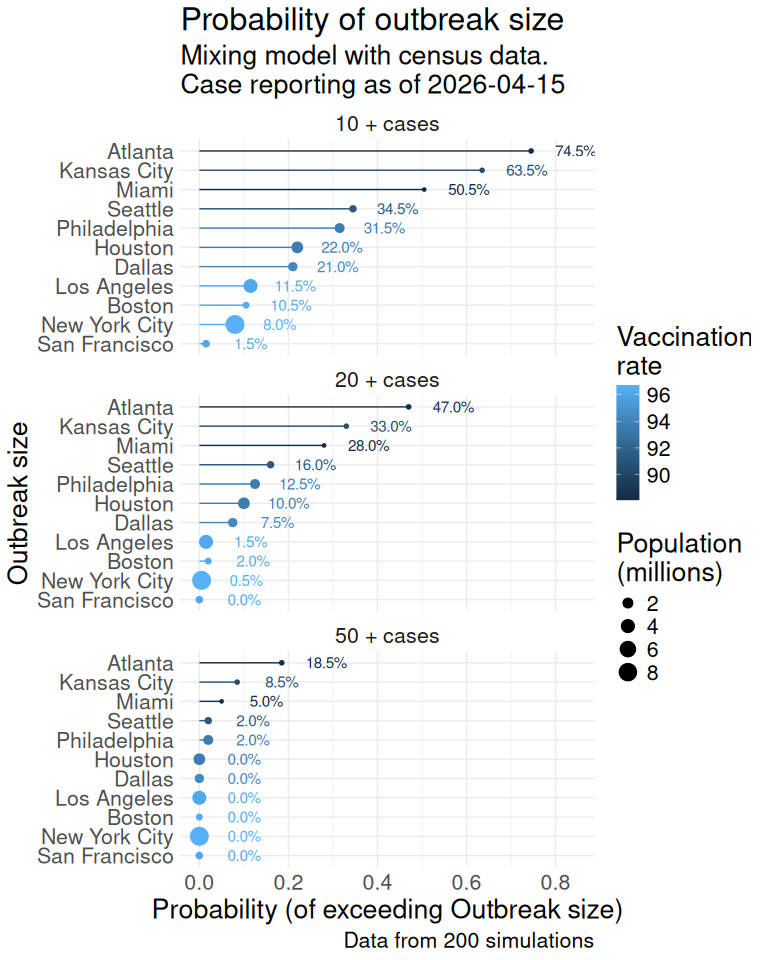

# idcup

 

This project provides agent-based measles outbreak simulations across the 11 major U.S. cities hosting the **2026 FIFA World Cup**. With large international crowds expected, understanding the risk of measles transmission is critical for public-health preparedness. The simulations are built on [epiworldR](https://github.com/UofUEpiBio/epiworldR) and the [measles](https://github.com/UofUEpiBio/measles) R package, using census-derived age structure and MMR vaccination coverage.

For technical details on the repository layout, data sources, model overview, and getting-started instructions, see [DETAILS.md](./DETAILS.md).

# Simulated Measles Outbreaks in US Cities hosting the 2026 FIFA World Cup

> [!CAUTION]
>
> ### Work in progress
>
> This scenario simulation is a work in progress. We are still reviewing
> the model, assumptions, and parameters. Please be mindful of this when
> interpreting the results.

The following figure summarizes the simulated measles outbreak size over
time for the 11 US cities hosting the 2026 FIFA World Cup. Each line
represents a single simulation, with the color indicating the
vaccination rate in that city. The simulations are based on a mixing
model using census data, and the case reporting is as of the latest
available date.

Here is an alternative visualization of the probability that the
outbreak size exceeds a given cut-off (10, 20, 50 cases) based on the
final outbreak size in the simulations. The points are colored by
vaccination rate and sized by population size. The numbers on top of the
bars indicate the probability in percentage.

You can go over individual city simulations in the `scenarios/`
directory:

- [Atlanta](scenarios/Atlanta.md)
- [Boston](scenarios/Boston.md)
- [Dallas](scenarios/Dallas.md)
- [Houston](scenarios/Houston.md)
- [Kansas City](scenarios/Kansas%20City.md)
- [Los Angeles](scenarios/Los%20Angeles.md)
- [Miami](scenarios/Miami.md)
- [New York City](scenarios/New%20York%20City.md)
- [Philadelphia](scenarios/Philadelphia.md)
- [San Francisco](scenarios/San%20Francisco.md)
- [Seattle](scenarios/Seattle.md)
