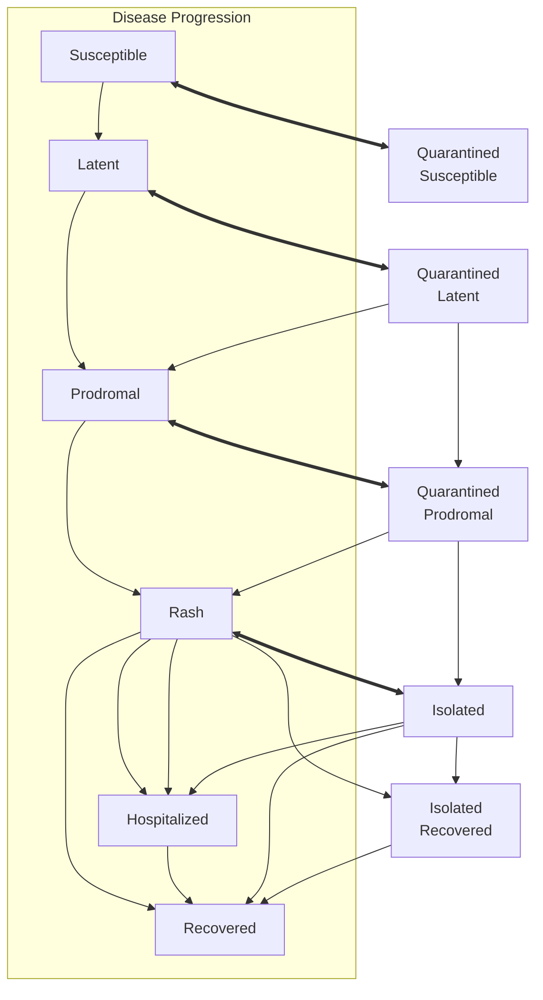
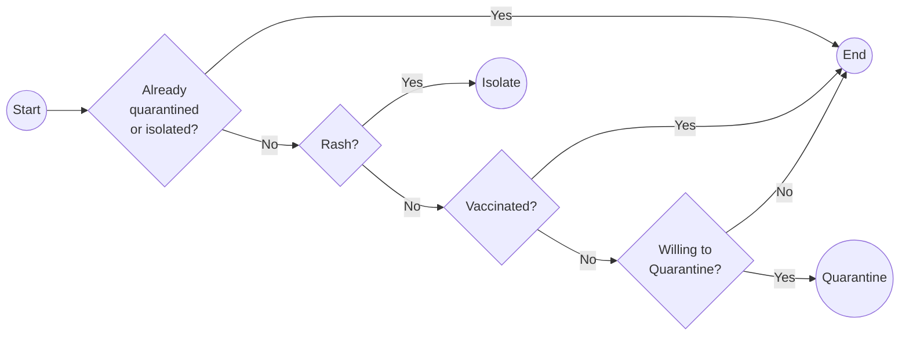

# idcup

[](https://github.com/EpiForeSITE/idcup/actions/workflows/render_reports.yml) [](https://github.com/EpiForeSITE/idcup/actions/workflows/update_measles_cases.yml)

Agent-based measles outbreak simulations across major U.S. cities, built on [epiworldR](https://github.com/UofUEpiBio/epiworldR) and the [measles](https://github.com/UofUEpiBio/measles) R package. Scenarios are parameterized Quarto documents that can be rendered per city using census-derived age structure and MMR vaccination coverage. You can see the latest version of the simulations in the [`scenarios`](./scenarios#simulated-measles-outbreaks-in-us-cities-hosting-the-2026-fifa-world-cup) folder

## Cities covered

Los Angeles, San Francisco, New York City, Boston, Houston, Dallas, Philadelphia, Atlanta, Seattle, Miami, Kansas City.

## Repository layout

```
data/
  census_age.csv       Age-structured population counts by city (generated)
  census_age.R         Script to pull county-level census data via multigroup.vaccine
  measles_cases.csv    County-level measles case updates mapped to project cities (generated)
  measles_cases.R      Script to pull measles case updates for project cities
  population.csv       Total city populations (source: census.gov)
  mmr.csv              MMR vaccination estimates by city (source: CDC MMWR 2023-24)
scenarios/
  template.qmd         Parameterized Quarto scenario document
  data/                City-specific data symlinked/copied for rendering
sensitivity_analyses/
  scaling_analysis.md  Report on why downscaling works in the model   
Makefile               Targets for data generation and package updates
```

## Getting started

### Prerequisites

Install the required R packages from GitHub:

```r
# Core simulation engine
remotes::install_github("UofUEpiBio/epiworldR")

# Measles model and helpers
remotes::install_github("UofUEpiBio/measles")

# Census data utilities (used by census_age.R)
remotes::install_github("EpiForeSITE/multigroup.vaccine")
```

Or use the Makefile targets:

```bash
make update-epiworldr
make update-measles
```

### Regenerate census age data

```bash
make data/census_age.csv
```

This calls `data/census_age.R`, which queries 2024 county-level census data for each city and writes `data/census_age.csv`.

### Run a scenario

Render the template for a specific city:

```bash
quarto render scenarios/template.qmd -P city:"Miami"
```

## Data sources

| File | Source |
|------|--------|
| `population.csv` | U.S. Census Bureau |
| `census_age.csv` | U.S. Census Bureau (2024, county-level, via `multigroup.vaccine`) |
| `measles_cases.csv` | [CSSEGISandData/measles_data](https://github.com/CSSEGISandData/measles_data) county-level update feed |
| `mmr.csv` | [CDC MMWR 2023–24 kindergarten vaccination coverage](https://www.cdc.gov/mmwr/volumes/73/wr/mm7341a3.htm) |

Relevant age groups: are 0to4, 5to9, 10to14, 15to19, 20to24, 25to29, 30to34, 35to39, 40to44, 45to49, 50to54, 55to59, 60to64, 65to69, 70to74, 75to79, 80to84, 85plus.

## Model overview

Each scenario runs an age-structured Agent-Based Model (ABM) of Measles with mixing populations. The model's main components are:

- Agents are organized based on age groups with their size informed by the US Census.
- Contact rates are based on the Polymod data and scaled using US Census.
- Agent's with Rash can be detected and trigger a quarantine process based on contact tracing.

Because the model uses a contact matrix, agents have heterogenous contact rates across groups.

### Transition dynamics



### Quarantine Process



### Implementation

We are using the [`{measles}`](https://github.com/UofUEpiBio/measles) R package, which runs on the C++ [`epiworld`](https://github.com/UofUEpiBio/epiworld) library.
