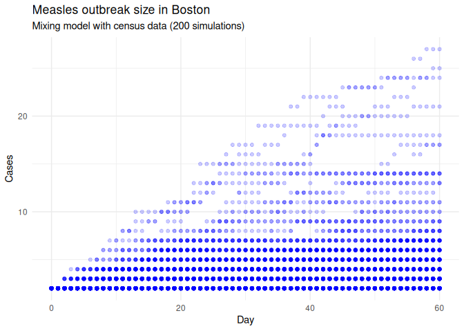
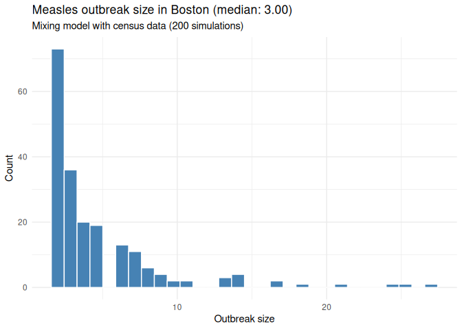

# Measles outbreak simulation in Boston

> [!CAUTION]
>
> ### Work in progress
>
> This scenario simulation is a work in progress. We are still reviewing
> the model, assumptions, and paramters. Please be mindful of this when
> interpreting the results.

## Preparing the environment

Pulling information about the city and population from the data files.
The mixing matrix is based on the Epistorm-Mix data, which provides
age-based contact patterns for the US:

Regarding the number of cases, we leverage information from Johns
Hopkins University (JHU) [U.S. Measles Data
Repository](https://github.com/CSSEGISandData/measles_data). From it, we
pull all the reported cases from the corresponding city. Since the data
does not include active cases but reported cases, we will estimate what
is the expected number of active cases considering the last reported
case as the most recent. Thus, all simulations will have at least one
active case at the start, and, if more cases have been reported, they
will be included in the simulation.

## Baseline scenario

For Boston, the vaccination rate is approximately 96.30%.

For the initial cases, we will use the expected number of active cases
based on the reported cases and the sampling approach described above.
We will distribute these initial cases randomly across the population.

We will use 2 initial cases in the simulations, distributed randomly
across the population. We can now run the simulations.

    Starting multiple runs (200) using 2 thread(s)
    _________________________________________________________________________
    _________________________________________________________________________
    ||||||||||||||||||||||||||||||||||||||||||||||||||||||||||||||||||||||||| done.

    ________________________________________________________________________________
    ________________________________________________________________________________
    SIMULATION STUDY

    Name of the model   : Measles with Mixing and Quarantine
    Population size     : 673466
    Agents' data        : (none)
    Number of entities  : 17
    Days (duration)     : 60 (of 60)
    Number of viruses   : 1
    Last run elapsed t  : 0.00m
    Total elapsed t     : 2.00m (200 runs)
    Last run speed      : 33.42 million agents x day / second
    Average run speed   : 60.65 million agents x day / second
    Rewiring            : off
    Last seed used      : 628712762

    Global events:
     - Quarantine process (runs daily)

    Virus(es):
     - Measles

    Tool(s):
     - MMR

    Model parameters:
     - (IGNORED) Vax improved recovery : 0.5000
     - Contact tracing days window     : 4.0000
     - Contact tracing success rate    : 0.8000
     - Days undetected                 : 2.0000
     - Hospitalization period          : 7.0000
     - Hospitalization rate            : 0.0370
     - Incubation period               : 12.0000
     - Isolation period                : 4.0000
     - Isolation willingness           : 0.9000
     - Prodromal period                : 4.0000
     - Quarantine period               : 21.0000
     - Quarantine willingness          : 0.9000
     - Rash period                     : 3.0000
     - Rash reduction contact rate     : 1.0000
     - Transmission rate               : 0.2000
     - Vaccination rate                : 0.9500
     - Vax efficacy                    : 0.9700

    Distribution of the population at time 60:
      - ( 0) Susceptible             : 673464 -> 673457
      - ( 1) Latent                  :      2 -> 0
      - ( 2) Prodromal               :      0 -> 0
      - ( 3) Rash                    :      0 -> 0
      - ( 4) Isolated                :      0 -> 0
      - ( 5) Isolated Recovered      :      0 -> 0
      - ( 6) Quarantined Latent      :      0 -> 0
      - ( 7) Quarantined Susceptible :      0 -> 4
      - ( 8) Quarantined Prodromal   :      0 -> 0
      - ( 9) Quarantined Recovered   :      0 -> 0
      - (10) Hospitalized            :      0 -> 0
      - (11) Recovered               :      0 -> 5

    Transition Probabilities:
     - Susceptible              1.00  0.00     -     -     -     -     -  0.00     -     -     -     -
     - Latent                      -  0.93  0.06     -     -     -  0.01     -     -     -     -     -
     - Prodromal                   -     -  0.75  0.25     -     -     -     -     -     -     -     -
     - Rash                        -     -     -  0.17  0.50     -     -     -     -     -  0.17  0.17
     - Isolated                    -     -     -  0.12  0.50  0.12     -     -     -     -     -  0.25
     - Isolated Recovered          -     -     -     -     -  0.67     -     -     -     -     -  0.33
     - Quarantined Latent          -     -     -     -     -     -  0.75     -  0.25     -     -     -
     - Quarantined Susceptible     -     -     -     -     -     -     -  1.00     -     -     -     -
     - Quarantined Prodromal       -     -     -     -  1.00     -     -     -     -     -     -     -
     - Quarantined Recovered       -     -     -     -     -     -     -     -     -     -     -     -
     - Hospitalized                -     -     -     -     -     -     -     -     -     -  0.86  0.14
     - Recovered                   -     -     -     -     -     -     -     -     -     -     -  1.00

We can save the results for further analysis.

## Session info

This document was generated using the `{measles}` R package version
0.3.2.0 and the `{epiworldR}` package version 0.15.1.0 on 2026-05-11. We
used R version 4.5.3, running on Linux with x86_64 architecture.
