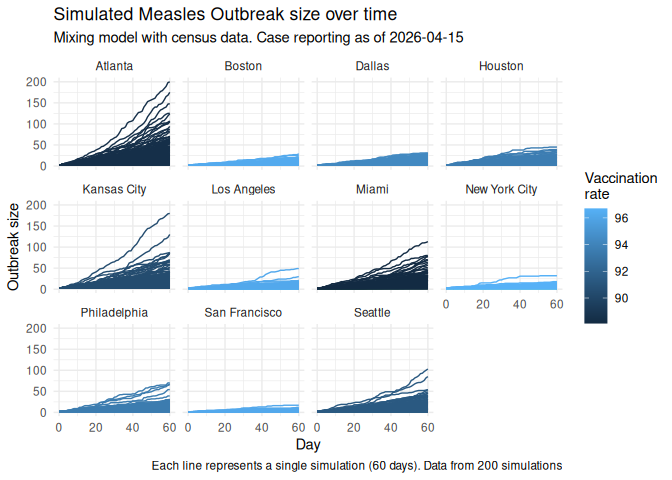

# Simulated Measles Outbreaks in US Cities hosting the 2026 FIFA World Cup

> [!CAUTION]
>
> ### Work in progress
>
> This scenario simulation is a work in progress. We are still reviewing
> the model, assumptions, and paramters. Please be mindful of this when
> interpreting the results.

The following figure summarizes the simulated measles outbreak size over
time for the 11 US cities hosting the 2026 FIFA World Cup. Each line
represents a single simulation, with the color indicating the
vaccination rate in that city. The simulations are based on a mixing
model using census data, and the case reporting is as of the latest
available date.

You can go over individual city simulations in the `scenarios/`
directory:

- [Atlanta](scenarios/Atlanta.md)
- [Boston](scenarios/Boston.md)
- [Dallas](scenarios/Dallas.md)
- [Houston](scenarios/Houston.md)
- [Kansas City](scenarios/Kansas%20City.md)
- [Los Angeles](scenarios/Los%20Angeles.md)
- [Miami](scenarios/Miami.md)
- [New York City](scenarios/New%20York%20City.md)
- [Philadelphia](scenarios/Philadelphia.md)
- [San Francisco](scenarios/San%20Francisco.md)
- [Seattle](scenarios/Seattle.md)
