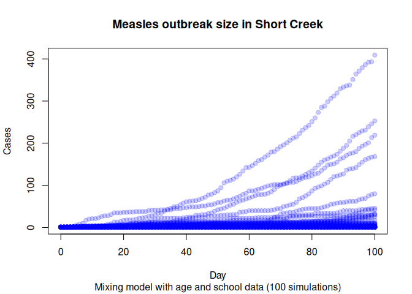
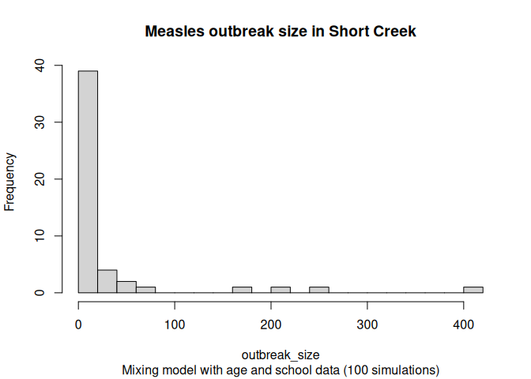

## Preparing the environment

``` r
library(measles)
```

    Loading required package: epiworldR

    Thank you for using epiworldR! Please consider citing it in your work.
    You can find the citation information by running
      citation("epiworldR")

``` r
library(data.table)

if (!exists("params")) {
  params <- list(city = "Miami")
}
```

``` r
# Population matrix
census_age <- fread("data/census_age.csv")[city == params$city]
population <- fread("data/population.csv")[city == params$city]

# Mixing matrix (dummy for the model)
gnames <- unique(census_age$age_group)
mixing <- matrix(1, nrow = length(gnames), ncol = length(gnames))
dimnames(mixing) <- list(gnames, gnames)
mixing[] <- mixing/rowSums(mixing)
```

``` r
N <- sum(population$Population) * .5
census_age[, total := ceiling(total/sum(total) * N)]
census_age[, vacc_rate := .9]

N <- sum(census_age$total)
```

## Baseline scenario

``` r
# Finding hospitalization rate for
# a 10% hospitalization probability
# P(hosp) = hosp_r / (hosp_r + rec_r)
#   => hosp_r = P(hosp) (hosp_r + rec_r)
#             = P(hosp) * hosp_r + P(hosp) * rec_r
#   => hosp_r = P(hosp) * rec_r / (1 - P(hosp))
h_rate <- 0.1 * (1 / 3) / (1 - 0.1)

measles_model <- ModelMeaslesMixing(
  n                            = N,
  prevalence                   = 1 / N,
  contact_rate                 = 15 / 0.9 / 4,
  transmission_rate            = 0.9,
  vax_efficacy                 = 0.97,
  contact_matrix               = mixing,
  hospitalization_rate         = h_rate,
  hospitalization_period       = 7,
  days_undetected              = 2,
  quarantine_period            = 21,
  quarantine_willingness       = 0.9,
  isolation_willingness        = 0.9,
  isolation_period             = 4,
  prop_vaccinated              = 0.95,
  contact_tracing_success_rate = 0.8,
  contact_tracing_days_prior   = 4,
  rash_period                  = 3
)
```

``` r
# Adding the entities to the model
add_entities_from_dataframe(
  model = measles_model,
  entities = census_age,
  col_name = "age_group",
  col_number = "total",
  as_proportion = FALSE
)
```

``` r
# Creating the distribution function
dist_fun <- distribute_tool_to_entities(
  prevalence = census_age$vacc_rate,
  as_proportion = TRUE
)

# Setting the distribution function
measles_model |>
  get_tool(0) |>
  set_distribution_tool(dist_fun)
```

``` r
measles_model |>
  run_multiple(
    ndays = 100,
    nsims = 50,
    seed  = 8812,
    saver = make_saver("outbreak_size", "hospitalizations"),
    nthreads = 4L
  )
```

    Starting multiple runs (50) using 4 thread(s)
    _________________________________________________________________________
    _________________________________________________________________________
    ||||||||||||||||||||||||||||||||||||||||||||||||||||||||||||||||||||||||| done.

``` r
# Extracting the results
ans <- measles_model |>
  run_multiple_get_results(
    freader = data.table::fread
  )

# Taking a look at the structure
str(ans)
```

    List of 2
     $ outbreak_size   :Classes 'epiworld_multiple_save_i', 'data.table' and 'data.frame':  5050 obs. of  5 variables:
      ..$ sim_num      : int [1:5050] 1 1 1 1 1 1 1 1 1 1 ...
      ..$ date         : int [1:5050] 0 1 2 3 4 5 6 7 8 9 ...
      ..$ virus_id     : int [1:5050] 0 0 0 0 0 0 0 0 0 0 ...
      ..$ virus        : chr [1:5050] "Measles" "Measles" "Measles" "Measles" ...
      ..$ outbreak_size: int [1:5050] 1 1 1 1 1 2 2 2 2 2 ...
      ..- attr(*, ".internal.selfref")=<externalptr> 
      ..- attr(*, "what")= chr "outbreak_size"
     $ hospitalizations:Classes 'epiworld_multiple_save_i', 'data.table' and 'data.frame':  92 obs. of  6 variables:
      ..$ sim_num : int [1:92] 1 3 3 3 3 3 3 3 3 3 ...
      ..$ date    : int [1:92] 23 44 53 63 68 92 96 54 84 88 ...
      ..$ virus_id: int [1:92] 0 0 0 0 0 0 0 0 0 0 ...
      ..$ tool_id : int [1:92] -1 -1 -1 -1 -1 -1 -1 0 0 0 ...
      ..$ count   : int [1:92] 1 1 1 1 2 1 1 1 1 1 ...
      ..$ weight  : int [1:92] 1 1 1 1 2 1 1 1 1 1 ...
      ..- attr(*, ".internal.selfref")=<externalptr> 
      ..- attr(*, "what")= chr "hospitalizations"
     - attr(*, "class")= chr [1:2] "epiworld_multiple_save" "list"

``` r
# Converting into data.table format for convenience
outbreak_size <- ans$outbreak_size |> as.data.table()
hospitalizations <- ans$hospitalizations |> as.data.table()
```

``` r
# Aggregating to get the final
with(
  outbreak_size,
  {
    plot(
      x = date,
      y = outbreak_size,
      col = adjustcolor("blue", alpha.f = .2),
      pch = 19,
      ylab = "Cases",
      xlab = "Day",
      main = "Measles outbreak size in Short Creek",
      sub = "Mixing model with age and school data (100 simulations)"
    )
})
```



``` r
# Aggregating to get the final
with(
  outbreak_size[date == max(date)],
  {
    hist(
      outbreak_size,
      main = "Measles outbreak size in Short Creek",
      sub = "Mixing model with age and school data (100 simulations)",
      breaks = 20
    )
})
```


