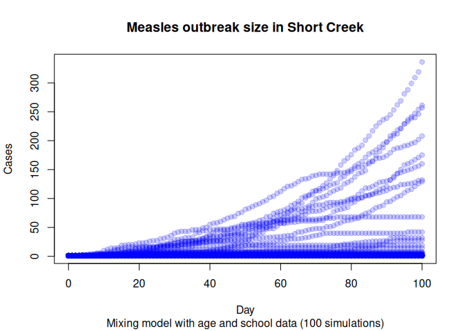
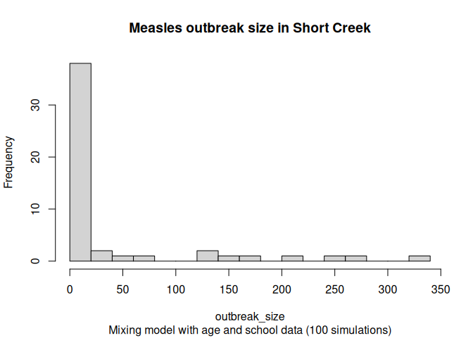

## Preparing the environment

``` r
library(measles)
library(data.table)

if (!exists("params")) {
  params <- list(
    city = "Miami",
    max_pop = 100000,
    nthreads = 4,
    echo = FALSE,
    seed = 8812,
    ndays = 100,
    nsims = 50
    )
}

knitr::opts_chunk$set(
  echo = params$echo,
  warning = FALSE,
  message = FALSE
)
```

## Baseline scenario

    Starting multiple runs (50) using 4 thread(s)
    _________________________________________________________________________
    _________________________________________________________________________
    ||||||||||||||||||||||||||||||||||||||||||||||||||||||||||||||||||||||||| done.





## Session info

This document was generated using the `{measles}` R package version
0.2.0.9000 and the `{epiworldR}` package version 0.14.99.99 on
2026-04-16. We used R version 4.5.3, running on Linux with aarch64
architecture.
